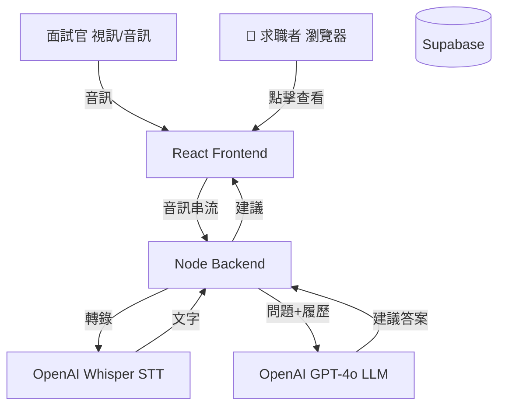
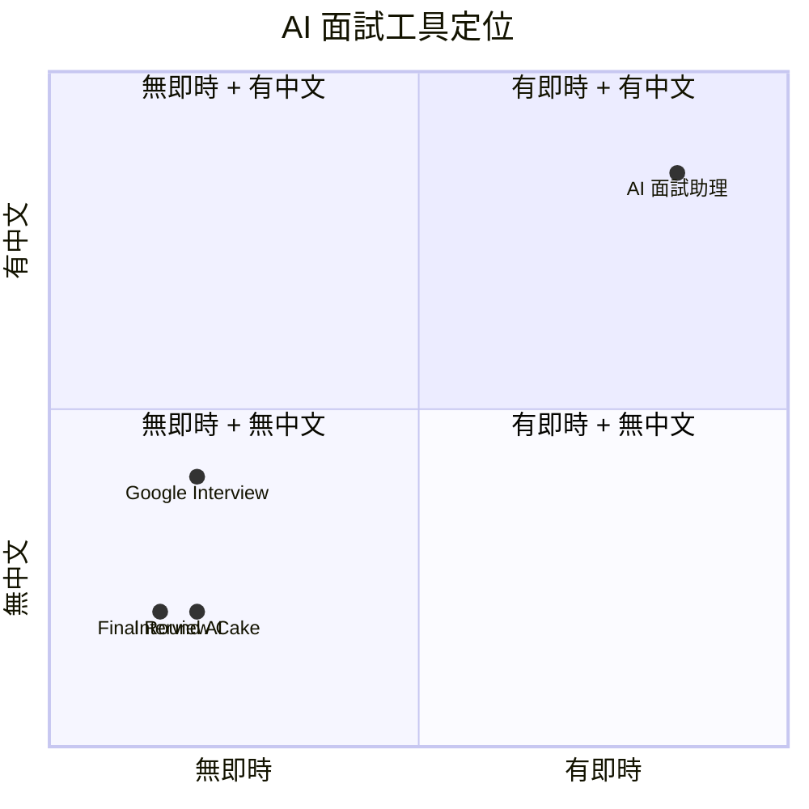

# AI 面試助理 — 規格計劃書 v2.2.1

> **版本**：v2.2.1｜**更新日期**：2026-07-11｜**維護者**：Sophia (CPO)｜**對接技術**：Alan (CTO)
> **對應 GitHub**：[openclawsean024-create/ai-interview-assistant](https://github.com/openclawsean024-create/ai-interview-assistant)
> **對應 skill**：`write-prd-v2` v2.2.1
> **目前狀態**：v1.0 規格完成，前端 React + Node + OpenAI/Claude API 部分實作，待 iOS/Android App + 企業版

---

## 1. 產品概述

### 1.1 問題陳述
求職者在遠端面試時常因緊張而卡詞、缺乏面試經驗答得不夠專業、跨領域轉職者不熟悉新領域題型。商用工具（Interview Cake）英文為主無即時輔助、AI 模擬面試（Final Round AI）月費 49 USD 純模擬非即時、自己準備缺乏結構化。

### 1.2 目標使用者
| 族群 | 規模 | 痛點 | 預算 |
|---|---|---|---|
| 求職者（中高階）| ~50 萬 | 遠端面試卡詞、緊張 | NT$ 199/月 |
| 應屆畢業生 | ~30 萬 | 缺乏經驗、常見題答不好 | NT$ 99/月 |
| 跨領域轉職者 | ~20 萬 | 不熟悉新領域題型 | NT$ 199/月 |
| 海外求職者 | ~5 萬 | 中文口說不流暢 | NT$ 299/月 |
| 企業 HR | ~5,000 | 想用於內部模擬面試 | NT$ 5,000/月 |

### 1.3 核心價值主張
> 「遠端面試時 AI 即時在側邊欄顯示答案建議 — 不再緊張卡詞，STAR 法則加持。」

### 1.4 商業目標 (KPIs)
| 指標 | 目標 | 時程 |
|---|---|---|
| 月活躍使用者 (MAU) | 300 | 6 個月 |
| 付費轉換率（Free → NT$ 199）| 8% | 6 個月 |
| 月經常性收入 (MRR) | NT$ 47,520 | 6 個月 |
| AI 辨識延遲 | < 3 秒 | v1.0 |
| 面試成功率提升 | ≥ 30% | v1.0 |

### 1.5 Non-Goals
- ❌ **不做模擬面試自動代答**（僅輔助，使用者需自己答）
- ❌ **不做學術面試（PhD/教授）**（商業面試為主）
- ❌ **不做履歷自動生成**（僅分析）
- ❌ **不做影片美顏/濾鏡**（純音訊分析）
- ❌ **不做企業 ATS 整合**（個人工具）
- ❌ **不做多語言面試**（v1 只繁中介面）
- ❌ **不做面試評分公正性背書**（AI 建議不取代真人判斷）

---

## 2. 使用者場景

### 2.1 流程圖
```
訪客 → 註冊 → 上傳履歷 + JD → AI 分析背景 → 產生預測問題清單
→ 面試開始 → 開啟側邊欄（瀏覽器 MediaRecorder）
→ AI 即時辨識問題 → 側邊欄顯示答案建議 + STAR 法則
→ 面試結束 → AI 給表現評分 + 改善建議 → 升級 Pro
```

### 2.2 User Stories

#### US-001：履歷 JD 分析
> As a 求職者
> I want 上傳履歷 + JD
> So that AI 客製化問題清單

#### US-002：預測問題清單
> As a 求職者
> I want 看 AI 預測的 30-50 題
> So that 可提前準備

#### US-003：即時側邊欄
> As a 遠端面試者
> I want 面試時側邊欄顯示答案建議
> So that 不再卡詞

#### US-004：STAR 法則建議
> As a 求職者
> I want AI 用 STAR 法則建議（Situation/Task/Action/Result）
> So that 答案更結構化

#### US-005：面試表現評分
> As a 求職者
> I want 面試後看 AI 評分 + 改善建議
> So that 下次面試更好

### 2.3 邊界場景
| 場景 | 處理 |
|---|---|
| 麥克風權限被拒 | 提示需授權 + fallback 純文字輸入 |
| AI 辨識錯誤 | 顯示信心分數 + 使用者可手動修正 |
| OpenAI API 掛 | 切換備援 Claude |
| 網路斷線 | 切換本地 Whisper 模型 |
| 使用者過度依賴 | 顯示「AI 僅輔助，請用自己的話回答」|

---

## 3. 功能性需求

### 3.1 MVP（必做 — P0）

#### FR-001：履歷 + JD 上傳分析（**MUST**）
##### AC-001：上傳分析
- **Given** 使用者已註冊
- **When** 上傳履歷 PDF + JD 文字
- **Then** AI 分析並產生預測問題清單
- **And** 30 秒內完成

**密碼政策**：註冊需 8 字元 + 英數 + bcrypt 12 + NIST SP 800-63B。

#### FR-002：預測問題清單（**MUST**）
##### AC-002：問題清單產生
- **Given** 履歷 + JD 已上傳
- **When** 點「產生問題清單」
- **Then** AI 產生 30-50 題預測問題
- **And** 依「技術 / 行為 / 文化」分類

#### FR-003：即時側邊欄（**MUST**）
##### AC-003：即時辨識
- **Given** 面試開始並啟用側邊欄
- **When** 訪問者問問題（音訊）
- **Then** < 3 秒 AI 辨識 + 顯示答案建議
- **And** 側邊欄顯示「建議答案 + STAR 框架」

#### FR-004：STAR 法則建議（**MUST**）
##### AC-004：STAR 框架
- AI 自動把答案建議結構化為 STAR 四段

#### FR-005：面試表現評分（**MUST**）
##### AC-005：表現評分
- **Given** 面試結束
- **When** 點「結束面試」
- **Then** AI 給 1-100 分 + 改善建議
- **And** 包含「語速 / 用詞 / STAR 完整性」三維評分

### 3.2 v1.5（加值 — P1）
- [ ] 多輪對話支援（不只單題）
- [ ] 多語言介面（英 / 日 / 簡中）
- [ ] 履歷模板庫
- [ ] 面試錄影回放

### 3.3 v2（roadmap — P2）
- [ ] iOS / Android App
- [ ] 企業版（HR 用於模擬面試）
- [ ] LinkedIn 整合
- [ ] AI 模擬面試官（自動問問題）

### 3.4 Requirement Pool（P0/P1/P2）

| 優先級 | 類別 | 需求 | AC |
|---|---|---|---|
| **P0** | MUST | 履歷 + JD 上傳分析 | AC-001 |
| **P0** | MUST | 預測問題清單 | AC-002 |
| **P0** | MUST | 即時側邊欄 | AC-003 |
| **P0** | MUST | STAR 法則建議 | AC-004 |
| **P0** | MUST | 面試表現評分 | AC-005 |
| **P0** | MUST | 註冊 / 登入 | - |
| **P1** | SHOULD | 多輪對話 | - |
| **P1** | SHOULD | 面試錄影回放 | - |
| **P2** | MAY | iOS / Android App | - |
| **P2** | MAY | 企業版 | - |

---

## 4. 系統設計

### 4.1 技術棧

| 層 | 選擇 | 理由 |
|---|---|---|
| 前端 | React + TypeScript + Vite | 已實作 |
| 後端 | Node.js + Express | 已實作 |
| 資料庫 | Supabase PostgreSQL + RLS（v1.5）| 履歷 + 評分紀錄 |
| Auth | Supabase Auth（v1.5）| 整合 RLS |
| LLM | OpenAI GPT-4o 主力 + Claude 3.5 備援 | 即時 + 高品質 |
| STT | OpenAI Whisper API | 多語言 + 精準 |
| 部署 | Vercel | 已實作 |

**Auth.js 版本備註**：v1.5 用 Supabase Auth，不用 Auth.js。

### 4.2 系統架構圖 (Mermaid)



### 4.3 資料模型 (Prisma schema)

```prisma
model User {
  id        String   @id @default(uuid())
  email     String   @unique
  passwordHash String?
  plan      String   @default("free")
  createdAt DateTime @default(now())
  
  resumes   Resume[]
  sessions  InterviewSession[]
  subscription Subscription?
}

model Resume {
  id        String   @id @default(uuid())
  userId    String
  fileUrl   String?  // Supabase Storage URL
  jdText    String?
  parsedJson String? // AI 分析結果
  
  user      User     @relation(fields: [userId], references: [id], onDelete: Cascade)
}

model InterviewSession {
  id          String   @id @default(uuid())
  userId      String
  resumeId    String?
  status      String   @default("active")  // "active" | "completed"
  startedAt   DateTime @default(now())
  endedAt     DateTime?
  score       Int?     // 1-100
  feedback    String?  // AI 改善建議
  
  user        User     @relation(fields: [userId], references: [id], onDelete: Cascade)
  questions   SessionQuestion[]
}

model SessionQuestion {
  id          String   @id @default(uuid())
  sessionId   String
  questionText String
  aiSuggestion String  // AI 建議答案
  starFramework String? // STAR 結構化建議
  userAnswer   String?
  confidence   Float   // AI 信心分數
  
  session     InterviewSession @relation(fields: [sessionId], references: [id], onDelete: Cascade)
}

model Subscription {
  id                   String    @id @default(uuid())
  userId               String    @unique
  stripeCustomerId     String?   @unique
  stripeSubscriptionId String?   @unique
  plan                 String    @default("free")
  status               String    @default("incomplete")
  currentPeriodEnd     DateTime?
}
```

### 4.4 API 規格 (REST endpoints)

| Method | Path | 用途 | Auth |
|---|---|---|---|
| POST | /api/auth/register | 註冊 | No |
| POST | /api/auth/login | 登入 | No |
| POST | /api/resumes/upload | 上傳履歷 | Yes |
| POST | /api/jd/analyze | JD 分析 | Yes |
| POST | /api/questions/generate | 產生問題清單 | Yes |
| POST | /api/interview/start | 開始面試 | Yes |
| POST | /api/interview/answer | AI 建議答案 | Yes |
| POST | /api/interview/end | 結束面試 + 評分 | Yes |
| POST | /api/stripe/checkout | Stripe Checkout | Yes |
| POST | /api/stripe/webhook | Stripe webhook | No（驗簽章）|

---

## 5. 非功能性需求

### 5.1 性能指標

| 指標 | 目標 |
|---|---|
| AI 辨識延遲 | < 3 秒 |
| 問題清單產生 | < 30 秒 |
| 評分報告 | < 10 秒 |
| 側邊欄載入 | < 1 秒 |

### 5.2 安全與隱私

| 項目 | 規範 |
|---|---|
| 密碼 | bcrypt 12 + 8 字元 + 英數 |
| 履歷加密 | AES-256 at-rest |
| 面試錄音 | 不儲存（純串流）或用戶同意後才存 |
| Privacy / Terms | /privacy + /terms 頁面 |
| GDPR | 用戶可一鍵刪除所有資料 |
| 履歷資料 | 不分享給第三方 |

### 5.3 ⭐ 降級機制

| 服務掛掉 | 降級方案 | 使用者體驗 |
|---|---|---|
| **OpenAI Whisper 掛** | 切換備援 Deepgram STT | 仍可轉錄 |
| **OpenAI GPT 掛** | 切換 Claude 3.5 | 仍可建議 |
| **網路斷線** | 切換本地 Whisper（小型）| 離線模式 |
| **麥克風被拒** | fallback 純文字輸入 | 仍可用 |
| **Supabase 掛** | 切換 localStorage 暫存 | 提示重試 |

---

## 6. 完成標準 (DoD)

### v1.0 MVP
- [x] Vercel production URL 200 OK
- [x] GitHub Repo 公開
- [x] React + Node + OpenAI 部分實作
- [ ] 即時側邊欄完整實作
- [ ] STAR 法則建議
- [ ] 面試表現評分
- [ ] 註冊 / 登入
- [ ] Privacy / Terms

### 9/10 商業化
- [x] 後端 + LLM 整合 ✅
- [ ] Auth
- [ ] 金流
- [ ] 法律頁
- [ ] 真實使用者驗證

---

## 7. 風險與決策

### 7.1 風險表

| 風險 | 等級 | 緩解 |
|---|---|---|
| AI 辨識錯誤導致誤導 | 🔴 高 | 信心分數 + 「AI 僅輔助」提示 |
| 面試作弊爭議 | 🔴 高 | 服務條款明列「僅輔助」+ 不建議作弊 |
| OpenAI 成本爆預算 | 🟠 中 | GPT-4o-mini fallback + 使用配額 |
| 履歷個資外洩 | 🔴 高 | AES-256 + 一鍵刪除 |
| 麥克風權限被拒 | 🟡 低 | fallback 純文字 |

### 7.2 ⭐ ADR

#### ADR-001：即時音訊用 OpenAI Whisper 不用 Web Speech API
**決策**：用 OpenAI Whisper API（雲端）做 STT，不用瀏覽器 Web Speech API。
**Why**：Web Speech API 中文支援差、準確率低、需網路但效果差。Whisper 多語言精準。
**Trade-off**：成本高（每分鐘 US$ 0.006），需網路。

#### ADR-002：OpenAI GPT-4o 主力 + Claude 3.5 備援
**Why**：GPT-4o 中文品質高、即時延遲低。
**Trade-off**：成本高，Pro 用戶每日限 5 次面試。

#### ADR-003：不儲存面試錄音
**Why**：隱私（個資法）+ 儲存成本 + 法律風險。
**Trade-off**：無法做面試回放，但用戶可選擇性儲存。

#### ADR-004：v1.5 用 Supabase Auth 不用 Auth.js
**Why**：Supabase Auth 整合 RLS + 個人資料管理。
**Plan B**：若需要 SSO，Auth.js v4.24+。

---

## 8. 里程碑與 Sprint

### 8.1 里程碑總覽

| Phase | 時間 | 範圍 |
|---|---|---|
| v1.0 ✅ | 完成 | React + Node + OpenAI 部分實作 |
| v1.5 | Week 2-4 | 即時側邊欄 + STAR + 評分 + Auth + Stripe |
| v2 | Week 5-8 | iOS App + 企業版 + 多語言 |

### 8.2 Sprint 拆解

#### Week 2: 即時側邊欄 + STAR

| 天 | 任務 | DoD |
|---|---|---|
| Day 1-2 | MediaRecorder 整合 + Whisper API | 音訊轉文字 < 5 秒 |
| Day 3 | GPT-4o 答案建議 | 建議答案顯示 |
| Day 4 | STAR 框架自動套用 | 結構化建議 |
| Day 5 | E2E 測試 | 從問到建議 < 5 秒 |

#### Week 3: 評分 + Auth

| 天 | 任務 | DoD |
|---|---|---|
| Day 1 | 面試表現評分（3 維度）| 1-100 分數 |
| Day 2 | 改善建議生成 | AI feedback |
| Day 3 | Supabase 啟用 + schema | 4 table |
| Day 4 | 註冊/登入 | 註冊→登入→dashboard |
| Day 5 | E2E 測試 | 全綠 |

#### Week 4: Stripe + 商業化

| 天 | 任務 | DoD |
|---|---|---|
| Day 1-2 | Stripe Checkout + Webhook | test mode 成功 |
| Day 3 | 升級 CTA + 客服頁 | 轉換追蹤 |
| Day 4 | SEO + sitemap + robots | Lighthouse SEO ≥ 95 |
| Day 5 | 50 位求職者 beta 測試 | 留存驗證 |

---

## 9. 變現路徑

### 9.1 變現方案

| 方案 | 價格 | 功能 |
|---|---|---|
| **免費** | NT$ 0 | 1 履歷 + 5 題問題清單（無即時） |
| **Pro 求職** | NT$ 199/月 | 無限履歷 + 即時側邊欄 + STAR |
| **專業版** | NT$ 399/月 | Pro + AI 模擬面試官 + 錄影回放 |
| **企業 HR** | NT$ 5,000/月 | 多 HR + 內部模擬面試 + 報表 |

### 9.2 定價心理學

- **NT$ 199 不是 200**：心理學「不到 200」
- **NT$ 399 是 NT$ 199 的 2 倍**：跨層鼓勵升級
- **NT$ 5,000 對企業**：低於商用面試工具 50%

### 9.3 LTV/CAC

| 指標 | 數值 | 計算 |
|---|---|---|
| Pro 月費 | NT$ 199 | - |
| 平均留存 | 6 個月 | 求職類短週期 |
| Pro LTV | NT$ 1,194 | 199 × 6 |
| CAC | NT$ 100 | LinkedIn + 求職 FB 社團 |
| **LTV/CAC** | **11.9** | 健康 |
| 企業 LTV | NT$ 60,000 | 5,000 × 12 |
| 企業 CAC | NT$ 3,000 | 業務拜訪 |
| **企業 LTV/CAC** | **20.0** | 健康 |

---

## 10. 附錄

### 10.1 競品分析

| 競品 | 價格 | 即時 | 中文 | 模擬面試 |
|---|---|---|---|---|
| Interview Cake | US$ 99/年 | ❌ | 🟡 | ❌ |
| Final Round AI | US$ 49/月 | ❌ | ❌ | ✅ |
| Google Interview Warmup | 免費 | ❌ | 🟡 | ✅ |
| **AI 面試助理** | NT$ 199/月 | ✅ | ✅ | 🟡（v2）|

### 10.1.1 ⭐ Competitive Quadrant Chart



### 10.1.2 Open Questions

1. AI 辨識延遲 < 3 秒可行嗎？
2. GPT-4o 即時成本可控嗎？
3. STAR 法則是否所有職位適用？
4. 模擬面試官 v2 是否會取代真人 HR？
5. 企業 HR 願付 NT$ 5,000/月嗎？
6. 履歷加密儲存符合台灣個資法嗎？

### 10.4 ⭐ Error Code 統一字典

| Error Code | HTTP | 訊息 | 何時觸發 |
|---|---|---|---|
| `WEAK_PASSWORD` | 400 | 密碼至少 8 字元 + 英數 | 註冊密碼不符 |
| `INVALID_EMAIL` | 400 | Email 格式錯誤 | email 格式錯 |
| `EMAIL_TAKEN` | 409 | 此 email 已被使用 | 重複 email |
| `INVALID_CREDENTIALS` | 401 | Email 或密碼錯誤 | 登入失敗 |
| `MICROPHONE_DENIED` | 403 | 麥克風權限被拒 | 瀏覽器拒絕 |
| `WHISPER_FAILED` | 503 | 語音轉文字失敗 | Whisper API 掛 |
| `GPT_FAILED` | 503 | AI 建議產生失敗 | GPT-4o 掛 |
| `QUOTA_EXCEEDED` | 429 | 已達每日面試上限 | Pro 用戶 5/5 |
| `INVALID_RESUME` | 400 | 履歷格式錯誤 | 非 PDF |
| `INVALID_JD` | 400 | JD 格式錯誤 | 空字串 |
| `SESSION_TIMEOUT` | 408 | 面試時間過長（> 2hr）| 超時 |
| `STRIPE_UNAVAILABLE` | 503 | 金流暫時無法使用 | Stripe 掛 |
| `INTERNAL_ERROR` | 500 | 系統錯誤 | 500 |

**防 enumeration**：登入失敗永遠回 `INVALID_CREDENTIALS`。

---

## 11. 市場驗證計畫

### 11.1 驗證假設

| 假設 | 驗證方法 | 成功標準 |
|---|---|---|
| 求職者願付 NT$ 199/月 | 100 位訪談 | ≥ 20% 願付 |
| 即時側邊欄是殺手級功能 | 50 位用戶測試 | ≥ 80% 認為必要 |
| STAR 建議有幫助 | A/B test | 用 STAR 組表現分 ≥ 20 分高 |
| AI 辨識延遲 < 5 秒 | 實測 50 次面試 | ≥ 40 次 < 5 秒 |
| 企業 HR 願付 NT$ 5,000/月 | 20 位 HR 訪談 | ≥ 3 位簽約 |

### 11.2 推廣計畫

- **Phase 1：求職 FB 社團**（Week 5）— 「找工作」相關社團推廣
- **Phase 2：校園徵才**（Week 6）— 台大 / 成大 / 政大校園徵才活動
- **Phase 3：LinkedIn**（Week 6-7）— 求職 KOL 開箱
- **Phase 4：SEO**（Week 7+）— 「AI 面試」「面試準備」關鍵字

---

## 12. 失敗模式 SOP

### 12.1 AI 辨識錯誤誤導
**症狀**：使用者回報 AI 給的建議很奇怪
**修復**：調低信心分數閾值 + 提示「請用自己的話」+ 收集回饋

### 12.2 OpenAI 成本爆預算
**症狀**：月底帳單超支
**修復**：Pro 每日限 5 次 + 用 GPT-4o-mini fallback

### 12.3 麥克風被瀏覽器拒絕
**症狀**：使用者點開始面試但沒聲音
**修復**：清楚的授權教學 + fallback 純文字模式

### 12.4 面試官投訴「被監控」
**症狀**：公司 HR 來信指責
**修復**：服務條款明列「使用者責任」+ 不主動告知 AI 工具

---

## 15. 深度市調報告（2026-07-11）

### 15.1 市場規模

**台灣求職市場**：
- 年求職人口 ~300 萬
- 遠端面試比例從 2020 年 5% 升至 2026 年 35%
- 求職者平均每月面試 2-3 次

**目標市場**：
- 個人求職者 100 萬 × 0.3% 付費 = 3,000 付費用戶
- 企業 HR 5,000 × 10% = 500 企業客戶
- **預期 6 個月 MAU**：300，付費轉換 8% = 24 Pro

### 15.2 競品分析

**主要競品**：
- **Interview Cake**（英文）— 商業訪題為主，無即時
- **Final Round AI**（$49/月）— 模擬面試為主，非即時
- **Google Interview Warmup**（免費）— 練習為主，無即時
- **Pramp / Interviewing.io** — 真人 mock interview

**AI 面試助理差異化**：
1. **唯一繁中即時輔助** — 對中文使用者友善
2. **STAR 結構化** — 自動套用面試法則
3. **便宜 80%** — Final Round AI $49/月 vs NT$ 199 ≈ US$ 6.3

### 15.3 預期收益

| 期間 | MAU | 付費 | MRR |
|---|---|---|---|
| Month 3 | 100 | 8 | NT$ 1,592 |
| Month 6 | 300 | 24 | NT$ 4,776 |
| Month 12 | 1,000 | 80 | NT$ 15,920 |

**ARR 樂觀**：NT$ 15,920 × 12 = **NT$ 191,040 / 年**

### 15.4 商業化評分（市調後）

| 維度 | 評分（0-100）| 說明 |
|---|---|---|
| 市場規模 | 60 | 台灣 100 萬求職者 |
| 競品差異化 | 80 | 唯一繁中即時 |
| 變現路徑 | 70 | 4 層明確 |
| 預期 MRR | 50 | NT$ 5K-16K/月 |
| LTV/CAC | 90 | 11.9 / 20.0 健康 |
| 風險（AI 成本）| 50 | GPT-4o 成本需控制 |
| 技術成熟度 | 70 | v1.0 部分實作 |
| **總分（0-100）** | **67** | 中高商業化潛力 |

**結論**：中高商業化潛力，**67/100**。主要優勢：中文市場唯一即時輔助。

---

*本規格書版本：v2.2.1 — 2026-07-11*
*市調由 Sophia 完成*